## ➤ VMware Workstation Pro 介绍

### VMware Workstation Pro 是什么？

**VMware Workstation Pro** 是 **VMware 产品系列**的其中一个版本，**VMware** 是一个**虚拟化产品**系列，包括了个人最常用的**桌面虚拟化产品**以及适用于服务器、云服务、网络安全等面向企业的虚拟化产品，本文只讨论面向个人的**桌面虚拟化产品**。

VMware 系列中的桌面虚拟化产品主要支持三大主流 PC 系统：Windows、Linux 和 MacOS，其中，

- **VMware Workstation** 支持 Windows 和 Linux；
- **VMware Fusion** 支持 MacOS。

而 **VMware Workstation Pro** 是 **VMware Workstation** 的专业版，也是最常见的版本。

### VMware Workstation Pro 下载安装步骤总结

**VMware Workstation Pro** 现在已经被**博通（Broadcom）**收购，而且**面向个人用户免费**，但是**下载必须注册登录博通账号**，官方（博通）已经明确说明了下载 VMware Workstation Pro 的步骤：

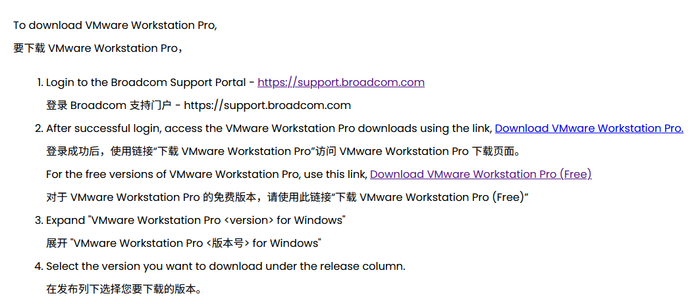

这里给出此篇文档的网址：<https://knowledge.broadcom.com/external/article?articleNumber=344595>，有能力的应该通过官方文档来下载安装，本文只是提供一些参考。

关于此说明中，带 “Free” 后缀的与不带的区别：**两者功能是一样的**，只是不带 “Free” 后缀是面向企业的，会有官方提供技术支持，**个人选择 Free 版本即可**。

因此要下载 VMware Workstation Pro 的安装包就必须要登录博通账号。

## ❶ 注册博通（Boadcom）账号（必须）

1. 打开博通**支持门户**官网【<https://support.broadcom.com/>】

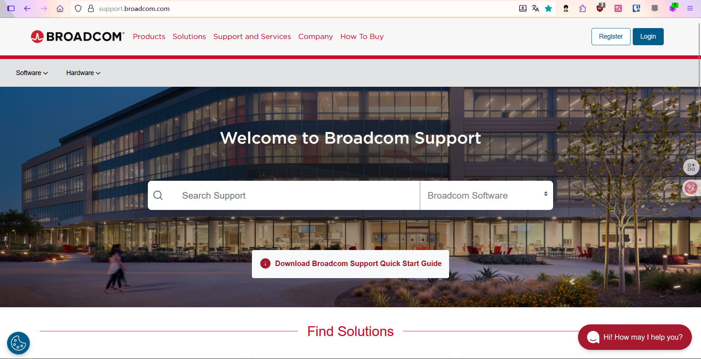

2. 点击【Register】

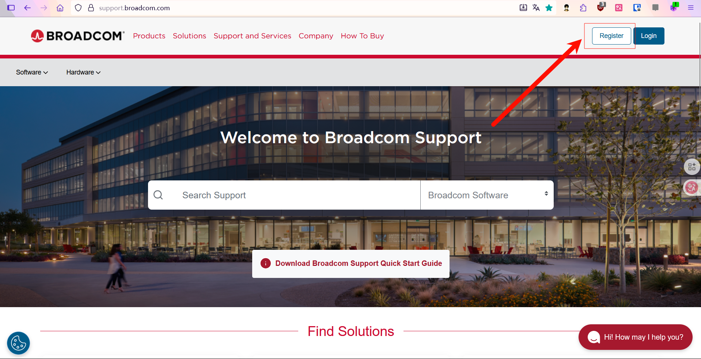

接下来就进入了博通账号注册页面（<https://profile.broadcom.com/web/registration>）

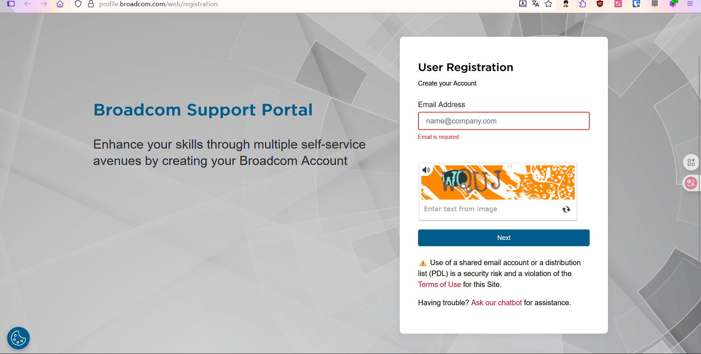

> 可以看到注册博通账号是需要邮箱账号的，这里**建议使用个人常用邮箱来注册**，因为保不准以后还会用到，所以同时建议你记录下注册的账号密码信息（这里强烈建议 Bitwarden）。

> **经实测网易邮箱是不行的**。

3. 输入邮箱、验证码，然后点击【Next】

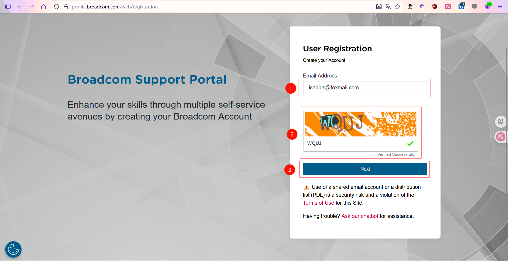

4. 输入邮箱收到的验证码，然后点击【Verify & Continue】

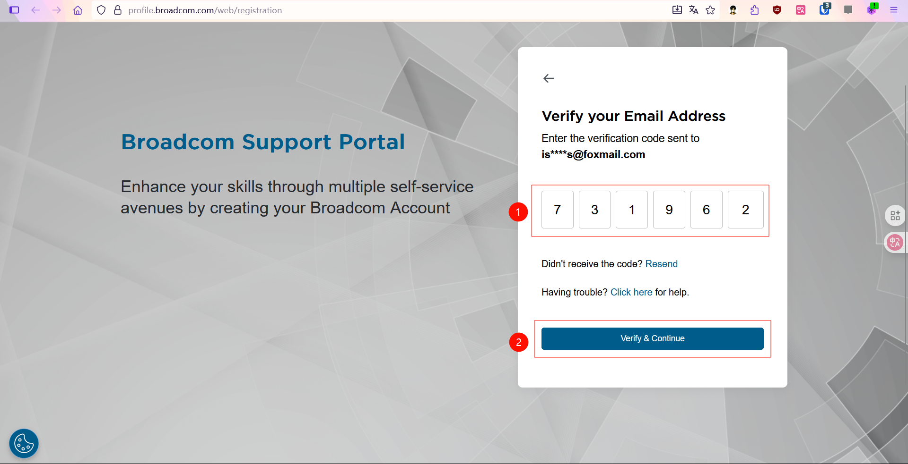

接下来就到了填写信息，设置密码的环节。

5 填写信息，设置密码，同意协议，然后点击【Create Account】

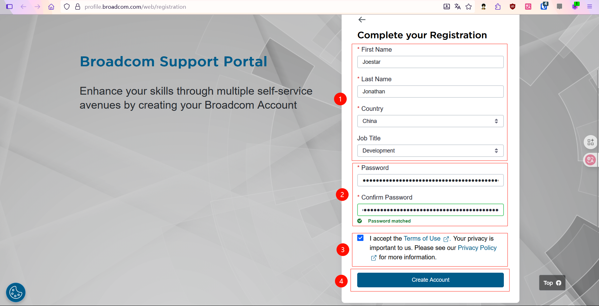

填写信息部分，随便填；

> 设置密码部分，再次建议，最好将账号密码记录下来，以防以后用到。- 另外，设置密码的时候，如果有跟我一样使用**随机生成的密码**的人要注意了，**这里的密码输入框似乎不能粘贴**，而且密码管理器插件（我使用的是 Bitwarden）将这个输入框识别为了登录时填写密码的框，这里说一下我的解决思路，我先将随机生成的密码**手动添加**到密码管理器中，然后在输入框中，使用密码管理器插件快捷输入，只要确保生成的密码符合要求就行。

然后就注册成功了。

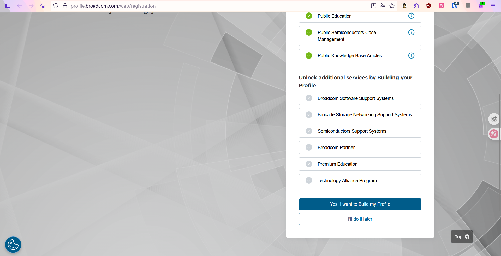

## ❷ 下载安装包

1.  点击下载链接，登录（或者你先登录，再点击也行）

也就是官方文档中给出的【[Download VMware Workstation Pro (Free)](https://support.broadcom.com/group/ecx/productdownloads?subfamily=VMware%20Workstation%20Pro&freeDownloads=true)】

点击后会**自动跳转到登录界面**，登录刚才注册的博通账号：

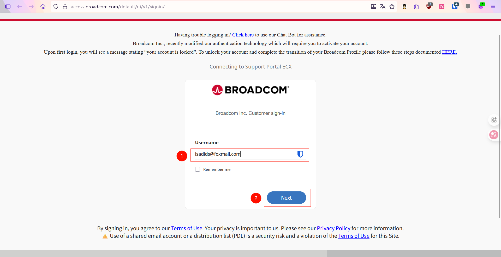

点击【Next】之后有可能会出现 Permission Denied 的情况，重新进一下上面的链接即可。（实在不行就先登录再点击）

然后就进入到了以下页面：

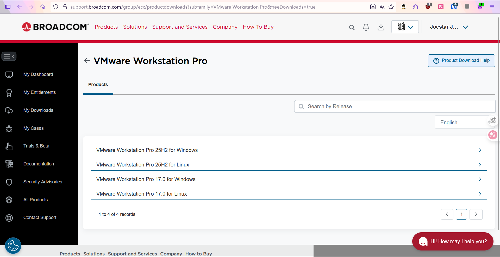

VMware Workstation Pro 25H2 是**目前最新版**，是博通收购之后为了与之前做出区分，改用了**新的版本号命名规则，实际上软件的改动不大**，没有特殊需求的话，使用最新版就可以。

2.  选择版本

先选择大版本，这里我以 25H2 for Windows 为例，然后选择更细致的小版本

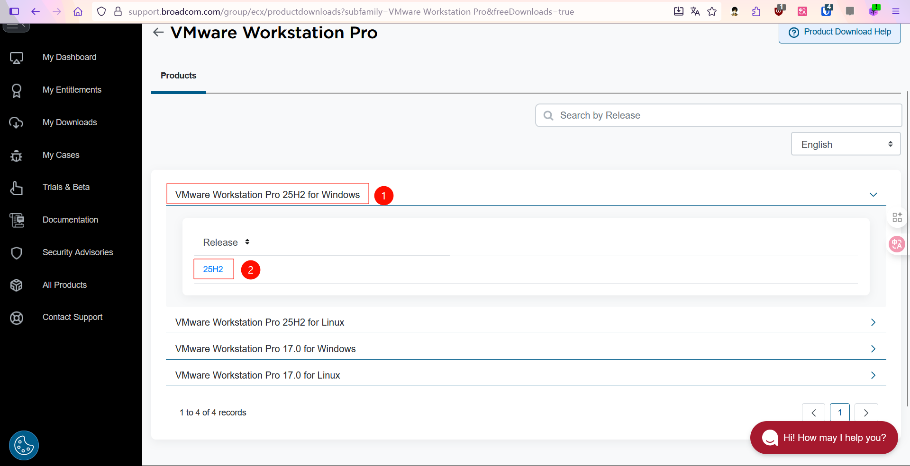

3.  同意协议，然后点击下载图标

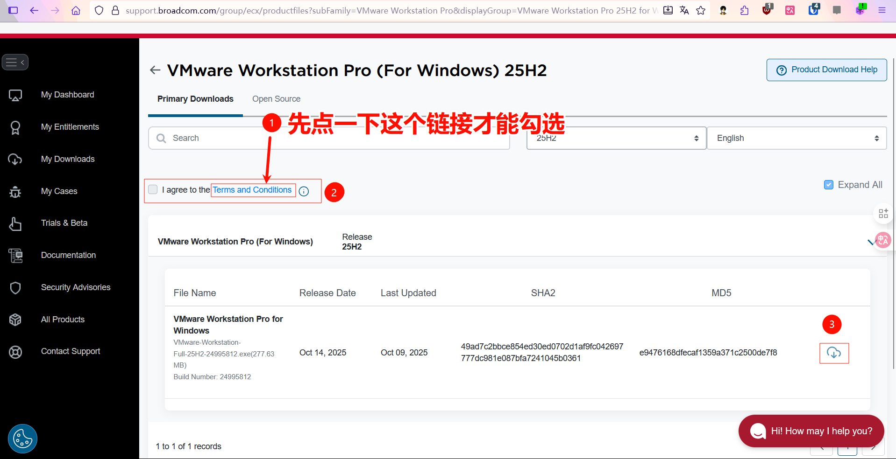

同意协议时，需要先点一下协议链接才能勾选。

点击之后会弹出一个对话框，点击【Yes】。

4.  进一步填写信息 💩
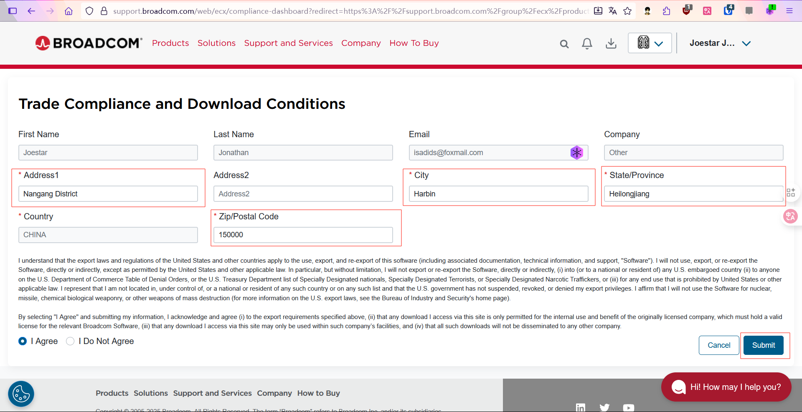

信息随便填，合理就行然后点【Submit】，之后就能正常下载了😀

## ❸ 安装

启动安装包
