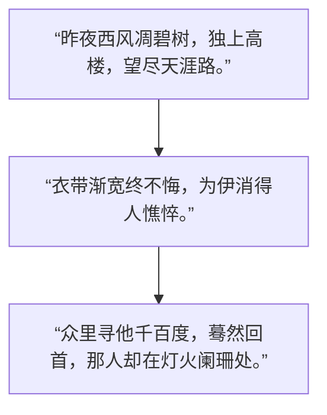

“昨夜西风凋碧树，独上高楼，望尽天涯路。”
“衣带渐宽终不悔，为伊消得人憔悴。”
“众里寻他千百度，蓦然回首，那人却在灯火阑珊处。”

## 昨夜西风凋碧树，独上高楼，望尽天涯路。
- **原意**：秋风吹落了绿叶，词人独自登上高楼，极目远眺，望向那通向远方的漫漫长路。
- **引申**：在追求学问之初，需有清醒的孤独感和高远的视野，敢于面对迷茫与未知，确立方向。
## 衣带渐宽终不悔，为伊消得人憔悴。
- **原意**：因思念心上人而日渐消瘦，衣带宽松，却始终无怨无悔。
- **引申**：在追求目标的过程中，即使身心俱疲、历经磨难，也坚定不移，甘愿付出一切。
## 众里寻他千百度，蓦然回首，那人却在灯火阑珊处。
- **原意**：在熙熙攘攘的人群中千百次寻找那个身影，不经意回头，却发现她正站在灯火稀疏之处。
- **引申**：经过长期苦思与积累，最终在看似不经意间豁然开朗，达到融会贯通、水到渠成的高峰。
